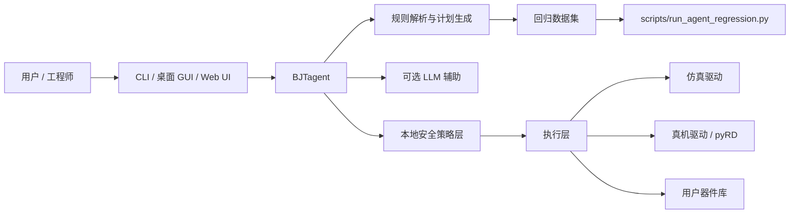
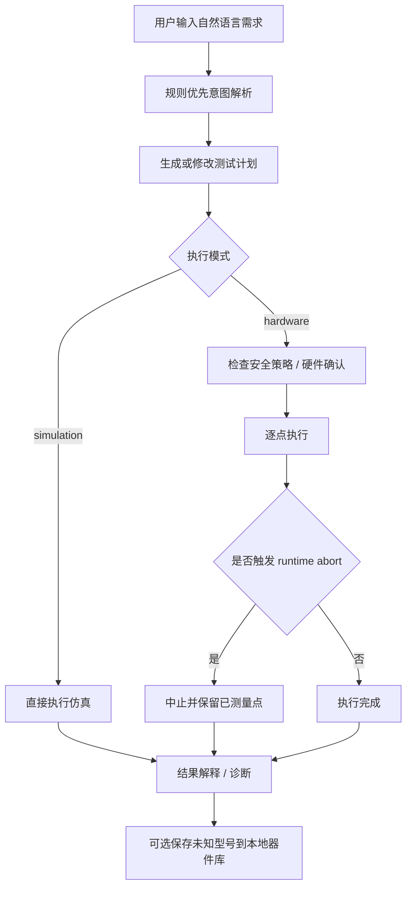

# 基于片上仪器平台的国产 BJT 自动化测试系统

这是一个面向双极型晶体管（BJT）的自动化测试系统仓库，围绕雨骤片上仪器平台构建，集成了：

- 本地仿真与真机测试链路
- CLI、桌面端、Web 前端三种交互入口
- `BJTagent` 测试 Agent
- 规则优先的意图解析与计划生成
- 可选 LLM 辅助
- 本地安全策略与运行时中止保护
- 数据驱动的回归评估体系

项目当前不是“纯大模型黑盒系统”，而是**规则 + LLM 可选辅助 + 本地安全策略 + 数据驱动回归评估**的 BJT 自动化测试系统。

## 系统能力概览

| 模块 | 当前能力 |
| --- | --- |
| 测试执行 | 支持仿真、静态点测试、曲线扫描、full-suite 流程 |
| Agent | 支持自然语言生成计划、修改计划、仿真执行、结果解释、器件库快捷管理 |
| 安全 | 支持 NPN 安全门、硬件确认、计划 clamp、运行时 abort |
| 未知型号 | 支持保守引导、字段补全、候选 profile、用户确认后沉淀到本地库 |
| 用户器件库 | 支持查看、搜索、更新、删除、启用/禁用，以及关键字段二次确认 |
| 回归 | 支持数据集回归、pytest 回归、CI 入口统一执行 |

## 系统组成图



## Agent 工作流



## 当前重点能力

### 1. BJTagent

`BJTagent` 是当前项目的测试 Agent 入口，已具备以下能力：

- 从中文自然语言中识别型号、目标、深度和约束
- 生成或修改安全测试计划
- 执行仿真并解释结果
- 对硬件执行施加本地确认与安全门
- 管理用户器件库的常见命令入口

### 2. 未知型号沉淀

当型号库中没有某个 BJT 时，系统可以先走保守引导路径：

- 追问 `管型 / Vceo / Ic 最大值 / Ptot`
- 规格完整后生成安全计划
- 完成测试后可提示保存到本地器件库
- 下次再测同型号时优先从本地库命中

### 3. 用户器件库管理

前端右侧已提供 `BJTagent / 器件库` 双标签切换：

- 查看与搜索已保存型号
- 查看详情
- 新增、更新、删除
- 启用 / 禁用
- 安全关键字段修改二次确认

## 快速开始

### 环境准备

1. 安装 Python 依赖

```bash
python3 -m pip install -r requirements.txt
```

2. 前端依赖安装

```bash
cd frontend
npm install
```

3. 硬件相关说明

- 当前仓库默认围绕雨骤 Model S / `pyRD` SDK
- SDK 目录位于 `IPSDK3.2/IP-SDK/Python/src`
- 真机模式下会走本地安全门，不会直接绕过硬件确认

## 常用命令

### 回归与测试

```bash
python3 scripts/run_agent_regression.py --json
python3 scripts/run_agent_regression.py
python3 -m pytest -q
```

### Agent CLI

```bash
python3 ai_cli.py 测 S8050 重点看 beta
python3 ai_cli.py 测 S8050 完整报告 --execute --json
python3 ai_cli.py 测 S8050 保守测试 beta --mode hardware --execute --confirm-hardware
```

### Web / 前端相关

```bash
cd frontend
npm run build
```

### 硬件 bring-up

```bash
python3 cli.py selftest --mode hardware
python3 cli.py scope-check --mode hardware --samples 2048 --freq 100000
python3 cli.py npn-static --mode hardware --vcc 3.0 --vbb 2.0
```

## 仓库结构

| 路径 | 说明 |
| --- | --- |
| `ai/` | Agent、对话、规则、规划、安全策略、用户器件库 |
| `app/` | 服务编排与运行时入口 |
| `api_server.py` | Web/API 服务入口 |
| `frontend/` | Web 前端与 `BJTagent` 交互层 |
| `gui/` | 桌面 GUI |
| `measurement/` | 测量、扫描、检测与曲线分析 |
| `core/` | 驱动抽象、设备层、安全常量和类型 |
| `scripts/` | 回归、数据评估、迁移脚本 |
| `tests/` | pytest 与前端 smoke |
| `数据/` | Agent 回归数据集与审计文件 |
| `docs/superpowers/` | 设计、计划、状态文档 |

## 安全边界

这是当前项目最重要的约束之一，首页明确列出：

- 自动硬件执行默认不直接开放
- 非明确 `NPN` 不会自动走硬件执行
- 未知型号先走保守引导，不恢复 `UNKNOWN -> NPN`
- PNP 可生成保守/引导计划，但自动硬件执行仍被阻断
- 硬件执行需要显式确认
- 计划层会对 `Ic / Vcc / Pmax` 做 clamp
- 真机逐点执行启用 runtime abort
- abort 后会保留已测量点并返回原因

## 回归与数据集

当前推荐的主回归入口：

```bash
python3 scripts/run_agent_regression.py --json
```

主要数据集：

- 金样本回归：`数据/agent_regression_cases.jsonl`
- 主线数据集：`数据/transistor_agent_samples.v3.jsonl`

CI 工作流：

- `.github/workflows/agent-regression.yml`

## 当前状态

当前仓库已经具备以下闭环：

- Web、CLI、桌面端三条入口并存
- `BJTagent` 可接入本地规则，也可接可选大模型 API
- 用户器件库与未知型号沉淀能力已接通
- 前端支持 Agent 状态、日志、器件库面板和运行时中止展示
- 安全门、运行时中止和回归入口已收口到可持续迭代的状态

如果你要继续开发，推荐先跑：

```bash
python3 scripts/run_agent_regression.py --json
python3 -m pytest -q
```
