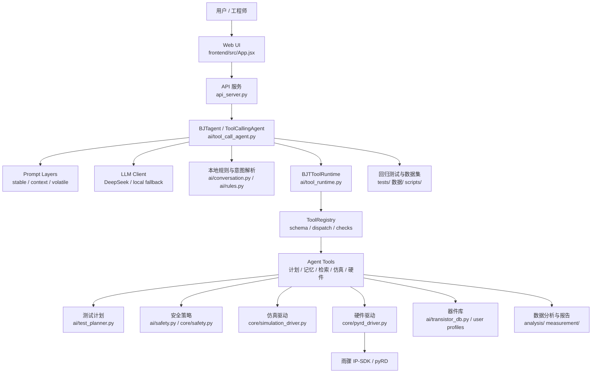
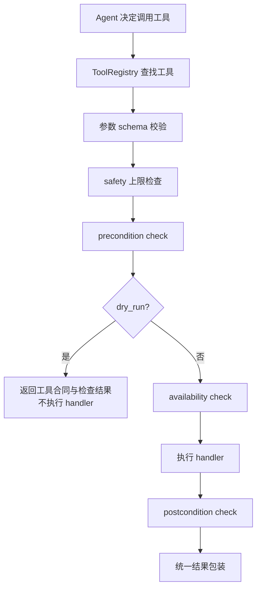

# BJTagent 项目概况

更新时间：2026-06-05

本文档描述当前仓库中“整个 Agent 项目”的结构与能力边界。这里的 Agent 项目不是单个 `ToolCallingAgent` 类，而是围绕 BJTagent 建立的完整系统：Web UI、API 服务、LLM 层、Prompt 分层、工具 registry、测试计划、安全策略、仿真/硬件执行、器件库、记忆、数据集与回归测试。

## 一句话概括

BJTagent 是一个面向 BJT 器件测试的 Web-first 自动化测试 Agent。它使用“LLM 参与决策 + 本地规则兜底 + 严格工具 registry + 安全门 + 雨骤 IP-SDK 硬件接口”的方式，把用户的自然语言需求转成可审计、可预演、可执行的测试流程。

当前系统的定位不是纯聊天机器人，也不是纯脚本工具，而是一个面向电子测试场景的实验型 Agent 框架。

## 当前主线

项目现在的开发主线是：

1. Web UI 作为主要交互入口。
2. Agent 每个关键环节都有 LLM 参与空间，但不能绕过本地安全规则。
3. 工具层采用 Hermes 风格的 registry 模式。
4. 工具不只是函数，还带参数 schema、安全上限、前置条件、后置检查、危险等级、dry-run 能力。
5. 硬件交互通过现有雨骤 `IP-SDK / pyRD` Python API 封装，不直接让 LLM 操作硬件底层。
6. BJT 器件库作为选型与计划生成上下文，最终 BOM 或真实硬件执行仍需要确认。

## 总体架构



## 目录结构

| 路径 | 作用 |
| --- | --- |
| `frontend/` | React + Vite Web UI。当前主要用户入口，包含 BJTagent 对话、设置、器件库等界面。 |
| `api_server.py` | 本地 HTTP API 服务，连接 Web UI、Agent、计划、执行、器件库和硬件动作。 |
| `ai/` | Agent 核心目录，包含 LLM、Prompt、意图解析、工具 runtime、registry、规划、安全、记忆、数据集评估。 |
| `app/` | 测试服务编排层，封装硬件/仿真驱动、full-suite、scope check、detect 等服务函数。 |
| `core/` | 底层驱动与硬件抽象，包括 pyRD 驱动、仿真驱动、设备 SDK 路径、安全常量、类型定义。 |
| `measurement/` | 静态点、曲线扫描、BJT 类型检测、线性度、Vce(sat) 等测量算法。 |
| `analysis/` | 结果处理、摘要、导出、报告生成。 |
| `config/` | 默认硬件参数、日志配置、用户器件库 JSON。 |
| `IPSDK3.2/` | 雨骤 IP-SDK、本地 Python 示例和文档。 |
| `tests/` | pytest 单元测试、集成测试、前端 smoke、Agent 行为回归测试。 |
| `数据/` | Agent 回归数据集、训练/审计样本。 |
| `scripts/` | Agent 数据集评估、迁移、回归脚本。 |
| `docs/` | 项目文档、参考方案、设计说明。 |

## Web UI 层

当前项目已经转向 Web UI，不再继续维护 GUI 桌面入口。

关键文件：

- `frontend/src/App.jsx`
- `frontend/src/main.jsx`
- `frontend/package.json`

当前 Web UI 主要包括：

- BJTagent 对话区
- 模型配置与连接状态
- 设置页
- 器件库页
- 应用配置
- 运行状态、任务、长期记忆等配置区
- 工具调用 / 理解过程显示开关

Web UI 通过 `api_server.py` 调用后端。常见 API 包括：

| API | 作用 |
| --- | --- |
| `GET /api/health` | 健康检查 |
| `POST /api/ai-chat` | BJTagent 对话主入口 |
| `POST /api/plan` | 生成测试计划 |
| `POST /api/execute-plan` | 执行计划 |
| `POST /api/preflight-plan` | 计划预检 |
| `POST /api/run-action` | 运行指定动作 |
| `POST /api/connect` | 连接设备 |
| `POST /api/emergency-off` | 安全关断 |
| `GET /api/user-profiles` | 用户器件库列表/详情 |
| `POST /api/user-profiles` | 新增用户器件 |
| `POST /api/user-profiles/update` | 更新用户器件 |
| `POST /api/user-profiles/delete` | 删除用户器件 |
| `POST /api/user-profiles/toggle-enabled` | 启用/禁用用户器件 |

## Agent 核心

当前 Agent 有两条相关但职责不同的路径：

| 模块 | 职责 |
| --- | --- |
| `ai/conversation.py` | 上下文意图解析。判断用户是在创建计划、修改计划、执行仿真、请求硬件、解释结果、管理器件库等。 |
| `ai/tool_call_agent.py` | Tool-calling Agent 主体。决定下一步调用哪个工具，执行多步任务，并汇总响应。 |
| `ai/tool_runtime.py` | BJTagent 的工具运行时，负责持有当前计划、执行结果、任务图、记忆、pending plan update，并调度工具。 |
| `ai/tool_registry.py` | Hermes 风格工具注册中心，统一 schema、dispatch、参数校验、安全检查、dry-run、pre/post condition。 |
| `ai/tool_schema.py` | 工具合同定义。 |
| `ai/prompt_layers.py` | Prompt 分层结构：stable、context、volatile。 |
| `ai/llm_client.py` | LLM API 调用层。 |
| `ai/test_planner.py` | BJT 测试计划生成。 |
| `ai/safety.py` | Agent 层安全策略与执行授权判断。 |
| `ai/task_delegation.py` | 子任务图，将复杂请求拆解为 profile、plan、safety、simulation、diagnosis 等阶段。 |
| `ai/agent_memory.py` | Todo 与长期记忆存储。 |
| `ai/session_search.py` | 当前会话上下文搜索。 |

## Prompt 分层

Prompt 系统已参考 Hermes 拆成三层：

| 层 | 内容 |
| --- | --- |
| `stable` | 稳定身份、协议、工具策略、安全规则、输出 schema。 |
| `context` | 当前计划、任务图、工具列表、会话状态、pending update 等上下文。 |
| `volatile` | 本轮用户消息、时间戳、step index、上一轮工具结果等动态输入。 |

当前使用位置：

- `ai/conversation.py`：意图解析 Prompt。
- `ai/tool_call_agent.py`：工具决策 Prompt。

这让系统后续可以继续加入：

- 用户画像
- 长期记忆
- 当前硬件状态
- 最近测试结果
- datasheet 摘要
- 项目文件上下文

而不需要把所有信息混到一段大 Prompt 中。

## 工具系统

工具层已经从“函数列表”升级为 registry 模式。

### 工具合同字段

每个工具可以携带：

- `name`
- `description`
- `parameters`
- `risk_level`
- `requires_confirmation`
- `category`
- `safety`
- `preconditions`
- `postconditions`
- `reversible`
- `dangerous`
- `requires_asset_lock`
- `supports_dry_run`
- `availability_check`
- `handler`

### dispatch 流程



### 当前主要工具

当前 `BJTToolRuntime` 暴露的工具包括：

| 工具 | 分类 | 作用 |
| --- | --- | --- |
| `todo` | agent | 管理任务列表 |
| `memory` | agent | 读写项目/用户长期记忆 |
| `session_search` | agent | 搜索当前会话、计划、日志、结果 |
| `delegate_task` | agent | 拆解复杂任务图 |
| `lookup_transistor` | agent | 查询本地确认器件库 |
| `build_test_plan` | test_system | 生成安全测试计划 |
| `propose_plan_update` | test_system | 生成待确认计划修改 |
| `apply_plan_update` | test_system | 用户确认后应用计划修改 |
| `evaluate_plan_safety` | safety | 评估计划能否执行 |
| `preflight_plan` | safety | 干运行预检，不触碰硬件 |
| `device_connect` | instrument | 连接雨骤设备或仿真驱动 |
| `device_emergency_off` | instrument | 紧急关闭输出 |
| `hardware_selftest` | instrument | 硬件自检 |
| `scope_check` | instrument | 示波器均值检查 |
| `detect_bjt_type` | dut_control | 检测 BJT 类型 |
| `run_static_point` | instrument | 执行单个静态测试点 |
| `run_vce_sat_point` | instrument | 执行 Vce(sat) 点 |
| `run_curve_scan` | instrument | 执行曲线扫描 |
| `run_full_suite` | test_system | 执行完整 BJT 测试套件 |
| `run_simulation` | simulation | 执行当前计划的仿真 |
| `diagnose_result` | analysis | 根据结果生成诊断标签与建议 |

### 示例：危险硬件工具合同

`run_static_point` 当前是高风险工具：

```yaml
tool: run_static_point
category: instrument
risk_level: high
requires_confirmation: true
dangerous: true
requires_asset_lock: true
supports_dry_run: true
args:
  mode: simulation | hardware
  vcc: number
  vbb: number
  allow_hardware: boolean
  token_valid: boolean
safety:
  max_voltage_v: 5.5
  max_current_a: 0.03
  requires_human_approval_if:
    mode: hardware
    allow_hardware: true
    token_valid: false
preconditions:
  - fixture_connected
  - current_plan_loaded_or_explicit_point
  - dut_power_off
postconditions:
  - measurements_within_plan_limits
  - outputs_disabled_after_point
```

## 测试计划与器件库

计划生成由 `ai/test_planner.py` 负责。输入通常包括：

- 型号
- BJT 类型
- 测试目标：`auto / beta / vce_sat / curves / screening / full`
- 测试深度：`conservative / standard / deep`
- 模式：`simulation / hardware`
- 限流、功耗、Vcc、静态点、扫描点等约束

器件库由两部分组成：

| 来源 | 说明 |
| --- | --- |
| 内置/确认库 | `ai/transistor_db.py` |
| 用户器件库 | `config/user_transistor_profiles.json` 与 `ai/user_profile_store.py` |

用户已经提供过 `common_bjt_200.json`，其中大多数器件原本标记为 `needs_user_datasheet_confirmation`，后续可批量转为已确认库或作为候选库导入。需要注意：同型号不同厂商、封装、hFE 分档的参数可能不同，最终硬件执行前仍应以目标 datasheet 为准。

## LLM 参与方式

当前设计不是“脱离 LLM 的硬规则系统”，而是“LLM 参与每个关键判断，但不能绕过本地约束”。

LLM 参与位置：

- 用户意图解析
- 工具选择
- 任务拆解
- 计划调整建议
- 结果解释
- datasheet/器件字段辅助理解
- 后续测试建议

本地规则负责：

- 安全兜底
- 硬件授权
- 参数 clamp
- unknown/PNP/NPN 风险分流
- 工具 schema 与 pre/post condition
- 回归测试稳定性

也就是说，LLM 负责“聪明”，本地系统负责“守边界、可复现、可审计”。

## 硬件接口

真实硬件路径为：

```text
BJTagent tool
  -> app.services
  -> core.pyrd_driver.PyRDDriver
  -> core.device.ensure_sdk_path()
  -> from pyRD import RD
  -> RD()
  -> 雨骤 IP-SDK
```

SDK 路径：

```text
IPSDK3.2/IP-SDK/Python/src
```

关键驱动文件：

| 文件 | 作用 |
| --- | --- |
| `core/device.py` | 设置 SDK 路径、DLL 搜索路径、SDK 运行时探测。 |
| `core/pyrd_driver.py` | pyRD 驱动封装，调用 `DeviceEnumLists`、`DeviceOpen`、`AnalogIOChannelNodeSet`、`AnalogOutConfigure`、`AnalogInRead` 等 API。 |
| `core/simulation_driver.py` | 仿真驱动，供开发与测试使用。 |
| `app/services.py` | 将 detect、selftest、scope check、static point、curve scan、full suite 封装为服务函数。 |

硬件执行现状：

- 默认不允许 LLM 直接真实硬件执行。
- `hardware` 模式需要 `allow_hardware`。
- 危险测量还需要 `token_valid`。
- 工具 registry 会先检查 schema、安全上限、preconditions。
- 执行后会附带 postcondition checks。
- 当前部分硬件状态还不可独立观测，例如 `dut_power_off`、真实输出关闭状态，所以会标记为 `skipped`，不伪造确定性。

## 安全边界

当前重要安全规则：

- 未知型号走保守计划。
- 非明确 NPN 不自动执行硬件测试。
- PNP 自动硬件执行被阻断。
- 硬件模式需要显式授权。
- 真实高风险工具需要确认 token。
- 工具参数会经过 schema 和安全上限检查。
- 危险工具支持 dry-run。
- 执行计划会经过 safety/preflight。
- 执行后保留结果和诊断上下文。

安全相关模块：

- `ai/safety.py`
- `ai/runtime_guard.py`
- `core/safety.py`
- `ai/tool_registry.py`
- `ai/tool_runtime.py`

## 数据、记忆与任务图

Agent 状态不是只存在一轮聊天里。

当前已有：

| 能力 | 文件 |
| --- | --- |
| Todo 任务列表 | `ai/agent_memory.py` |
| 项目/用户长期记忆 | `ai/agent_memory.py` |
| 当前会话搜索 | `ai/session_search.py` |
| 子任务图 | `ai/task_delegation.py` |
| Pending plan update | `ai/tool_runtime.py` |
| 当前计划/执行结果 | `BJTToolRuntime` |

这些状态会进入 Prompt 的 `context` 或 `volatile` 层，帮助 LLM 知道当前做到了哪一步。

## 测试与回归

当前测试体系较完整：

| 类型 | 位置 |
| --- | --- |
| Agent 行为测试 | `tests/test_ai_agent.py`、`tests/test_tool_call_agent.py` |
| Prompt 分层测试 | `tests/test_prompt_layers.py` |
| Tool registry 测试 | `tests/test_tool_registry.py` |
| API 测试 | `tests/test_api_server.py` |
| 前端 smoke | `tests/test_frontend_*` |
| 安全策略测试 | `tests/test_ai_safety_*`、`tests/test_execution_safety.py` |
| 器件库测试 | `tests/test_transistor_profile_store.py`、`tests/test_user_profile_manager.py` |
| 数据集回归 | `scripts/run_agent_regression.py`、`数据/agent_regression_cases.jsonl` |

最近一次全量测试结果：

```text
314 passed
```

常用验证命令：

```bash
python3 -m pytest -q
python3 scripts/run_agent_regression.py --json
cd frontend && npm run build
```

## 当前已具备的能力

1. 用户可以在 Web UI 中用中文请求 BJT 测试方案。
2. Agent 能识别型号、目标、模式、深度和约束。
3. Agent 能生成测试计划，并区分“只要方案”和“执行仿真”。
4. Agent 能细化测试点，先生成 pending update，等待用户确认后再应用。
5. Agent 能运行仿真并解释结果。
6. Agent 工具层已经具备 registry、schema、safety、dry-run、pre/post condition。
7. 硬件接口已经封装到雨骤 IP-SDK/pyRD 路径。
8. 器件库支持用户自定义与后续沉淀。
9. Prompt 已分层，方便后续接入更多上下文与记忆。
10. 测试体系能保护核心行为不回退。

## 主要不足

当前系统还不是完整成熟的实验室 Agent，主要不足包括：

1. `asset lock` 还只是工具合同字段，没有真正的实验台锁管理器。
2. 一些 precondition/postcondition 还不可独立观测，只能标记 `skipped`。
3. 仪器工具分类已经设计，但还没有接入独立 PSU、DMM、Scope、AWG、电子负载等外部仪器。
4. datasheet 自动解析与器件库确认流程还需要继续增强。
5. LLM 对计划质量的评审还可以更主动，例如覆盖截止/放大/饱和区、测试点密度、风险分阶段策略。
6. 工具模块还集中在 `ai/tool_runtime.py`，后续应拆成多个自注册模块。
7. 硬件执行的真实闭环还需要更多设备状态传感和输出状态验证。

## 推荐下一步

建议按这个顺序继续增强：

1. **实验台 Asset Lock**
   - 实现 `reserve_test_station` / `release_test_station` 状态管理。
   - `requires_asset_lock=True` 的工具没有锁就不能真实执行。

2. **工具模块拆分与自注册**
   - 拆出 `ai/tools/agent_tools.py`
   - 拆出 `ai/tools/hardware_tools.py`
   - 拆出 `ai/tools/dut_tools.py`
   - 拆出 `ai/tools/test_system_tools.py`
   - 拆出 `ai/tools/analysis_tools.py`

3. **硬件状态可观测化**
   - fixture connected
   - DUT power off
   - outputs disabled
   - measured voltage within tolerance

4. **LLM 计划评审器**
   - 在执行前让 LLM 评审计划覆盖性和风险。
   - 输出结构化 review：缺失测试点、危险区域、建议阶段化策略。

5. **datasheet 到器件库流水线**
   - 用户上传 datasheet 或 JSON。
   - LLM 提取字段。
   - 本地 schema 校验。
   - 用户确认后进入正式库。

6. **更完整的仪器工具族**
   - PSU、DMM、Scope、AWG、DAQ、Relay Matrix、Chamber、E-load 等都按 registry schema 接入。

## 开发入口速查

启动 API：

```bash
python3 api_server.py
```

启动前端：

```bash
cd frontend
npm run dev
```

启动集成 Web：

```bash
python3 start_web.py
```

运行测试：

```bash
python3 -m pytest -q
```

查看工具 schema：

```bash
python3 - <<'PY'
from ai.tool_runtime import BJTToolRuntime
for schema in BJTToolRuntime().schemas():
    print(schema.to_llm_schema())
PY
```

dry-run 示例：

```bash
python3 - <<'PY'
from ai.tool_runtime import BJTToolRuntime
runtime = BJTToolRuntime()
record = runtime.dispatch(
    "run_static_point",
    {"mode": "simulation", "vcc": 3.0, "vbb": 2.0, "dry_run": True},
)
print(record.result)
PY
```

## 总结

当前 BJTagent 项目已经形成了一个比较清晰的 Agent 框架：

- 前端负责交互。
- API 负责连接 UI 与后端能力。
- LLM 负责理解、规划、工具选择和解释。
- 本地规则负责安全兜底。
- ToolRegistry 负责把工具变成可审计的能力对象。
- BJTToolRuntime 负责维护计划、执行、任务图、记忆和工具上下文。
- app/core/measurement/analysis 负责真实测试、仿真、硬件驱动与报告。

下一阶段的重点不应该是继续堆聊天功能，而是让 Agent 更像真正的测试工程师：先理解任务，再审查计划，再 dry-run，再拿锁，再执行，再验证后置条件，最后把结果沉淀成可复用知识。
